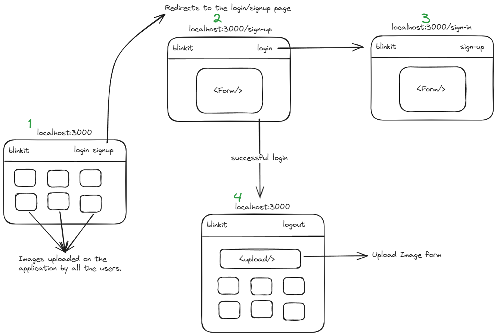

## run locally
1. Open the zip file in Code Editor (VScode).
2. Open terminal in the root directory, run following command. 
```
npm install
```
```
npm run dev
```
3. The application will be running in the 
```
http://localhost:3000/
```

## The webapp is hosted on 
```
https://image-upload-git-main-ajaysinghpanwar2002.vercel.app/
```
